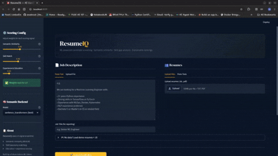

# 🎯 ResumeIQ — ML-Powered Resume Screening System

[](https://github.com/anaboset/ResumeIQ/actions)
[](https://python.org)
[](https://hub.docker.com)
[](LICENSE)
[](https://github.com/anaboset/FUTURE_ML_03/commits/main)
[](https://github.com/anaboset/ResumeIQ/stargazers)
[](https://github.com/anaboset/ResumeIQ/network/members)

> **Automatically screen, score, and rank job candidates using a 3-signal ML ensemble. Built for HR teams, recruiters, and HR-tech platforms.**


---

## 🖥️ [Live Demo](https://anaresumeiq.streamlit.app/)

👉 **[Try the live app →](https://anaresumeiq.streamlit.app/)**



---

## 💡 Why ResumeIQ?

Traditional applicant tracking systems rely heavily on keyword matching,
often missing strong candidates due to wording differences.

ResumeIQ uses semantic embeddings + structured scoring
to produce more meaningful candidate rankings while remaining
interpretable and recruiter-friendly.

---

## ⚡ Key Highlights

- 3-signal ML ensemble scoring
- Semantic resume ↔ job matching
- 200+ skill taxonomy
- Interactive Streamlit dashboard
- Dockerized & CI-ready
- Explainable candidate ranking
---

## 🧠 Pipeline Overview


```
Resume PDF/Text ──┐
                  ├──► Preprocessor ──► Skill Extractor ──► Scorer ──► Ranker ──► Dashboard
Job Description ──┘
```
---
### Scoring Architecture

| Signal | Weight | Method | What it captures |
|--------|--------|--------|-----------------|
| 🔵 Semantic Similarity | **45%** | `sentence-transformers` (MiniLM-L6-v2) cosine similarity | Overall domain & language alignment |
| 🟢 Skill Match | **40%** | Taxonomy-based exact + alias matching (200+ skills) | Required skill coverage & gaps |
| 🟣 Experience Score | **15%** | Education level + years of experience heuristics | Seniority & qualification fit |

**Weights are fully configurable** via the dashboard sidebar.


---

## ✨ Features

### Screening
- Resume/JD semantic matching
- Skill gap analysis
- Candidate ranking

### Explainability
- Plain-English score explanations
- Missing vs matched skills
- Signal-level breakdowns

### Platform
- Docker support
- CSV export
- Configurable scoring weights

---

## 🚀 Quick Start

### Option A — Docker (recommended)

```bash
git clone https://github.com/anaboset/ResumeIQ.git
cd ResumeIQ

docker compose up
```

Open [http://localhost:8000](http://localhost:8000) — the app is ready.

To run in debug mode with hot-reload:

```bash
docker compose -f compose.debug.yaml up
```

### Option B — Local Python

```bash
git clone https://github.com/anaboset/ResumeIQ.git
cd ResumeIQ

python -m venv .venv
source .venv/bin/activate  # Windows: .venv\Scripts\activate

pip install -r requirements.txt
```

```bash
streamlit run app/dashboard.py --server.port=8000
```

Open [http://localhost:8000](http://localhost:8000) — click **Load Demo Data** to see it in action immediately.

### Option C — Use as a library

```python
from src.pipeline import ResumeIQPipeline

pipeline = ResumeIQPipeline()

ranked_df, summary = pipeline.run(
    resumes=["path/to/resume1.pdf", "path/to/resume2.pdf"],
    job_description="path/to/jd.txt",
    job_title="Senior ML Engineer",
)

print(ranked_df[["name", "final_score_pct", "tier", "matched_skills", "missing_skills"]])
```

---

## 📁 Project Structure

```
ResumeIQ/
│
├── src/                              # Core ML pipeline
│   ├── __init__.py
│   ├── preprocessor.py               # Text cleaning, PDF extraction, lemmatization
│   ├── skill_extractor.py            # NER, name extraction, contact info
│   ├── scorer.py                     # 3-signal ensemble scoring engine
│   ├── ranker.py                     # Ranking, explainability, summary reports
│   ├── pipeline.py                   # Orchestration layer
│   └── taxonomies/
│       └── skills_taxonomy.py        # 200+ skill definitions with aliases
│
├── app/
│   ├── dashboard.py                  # Streamlit entry point
│   ├── ui/
│   │   ├── styles.py                 # Custom CSS (injected at runtime)
│   │   └── charts.py                 # Plotly chart builders (gauge, radar, etc.)
│   └── utils/
│       └── files.py                  # Temp file handling & cleanup
│
├── data/
│   ├── demo_data.py                  # Demo JD and resume templates
│   └── raw/                          # Place Kaggle dataset here (gitignored)
│
├── tests/
│   └── test_scorer.py                # 30+ unit + integration tests
│
├── Dockerfile                        # Production image (Python 3.11-slim)
├── compose.yaml                      # Standard Docker Compose
├── compose.debug.yaml                # Debug Compose with hot-reload
├── .dockerignore
├── .github/workflows/ci.yml          # GitHub Actions CI (Python 3.11)
├── .streamlit/config.toml            # Streamlit theme config
├── requirements.txt
└── README.md
```

---

## 🐳 Docker Details

The production image is built on `python:3.11-slim` and runs as a non-root user for security. The spaCy model is baked into the image at build time using a direct wheel URL, which is more reliable than running `spacy download` at container startup.

```dockerfile
# spaCy model installed at build time — no runtime downloads
RUN pip install \
  https://github.com/explosion/spacy-models/releases/download/en_core_web_sm-3.7.1/en_core_web_sm-3.7.1-py3-none-any.whl
```

The app is served on **port 8000** (not the default 8501) to avoid conflicts with other local services.


---

## 📊 Dataset

This project is compatible with the [Kaggle Resume Dataset](https://www.kaggle.com/datasets/snehaanbhawal/resume-dataset).

Download and place at: `data/raw/UpdatedResumeDataSet.csv`

The app also ships with built-in demo data (`data/demo_data.py`) so you can explore the full pipeline without downloading anything.

---

## 🧩 Architecture Choices

| Decision                 | Why                                                      |
| ------------------------ | -------------------------------------------------------- |
| **Sentence embeddings**  | Captures semantic meaning beyond keyword overlap         |
| **3-signal ensemble**    | Balances semantic fit, skill alignment, and experience   |
| **Configurable weights** | Lets recruiters tune scoring per role                    |
| **Rule + ML hybrid**     | More explainable and adaptable than fully trained models |
| **Modular pipeline**     | Easy to extend, test, and deploy                         |


---

## 🛠️ Tech Stack

| Layer | Technology |
|-------|-----------|
| Language | Python 3.11 |
| NLP | spaCy 3.7, NLTK, sentence-transformers |
| ML | scikit-learn, numpy |
| PDF parsing | pdfplumber |
| Dashboard | Streamlit, Plotly |
| Containerization | Docker, Docker Compose |
| Testing | pytest, pytest-cov |
| CI/CD | GitHub Actions |


---

*Built by a AI/ML trainee & Pharmacy student
